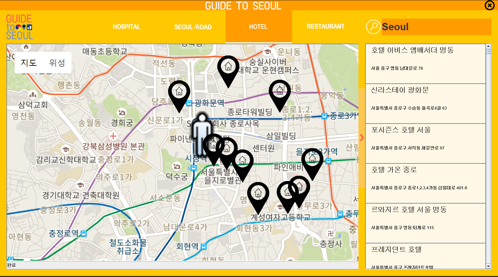

# Guide To Seoul

made by Team GuideToSeoul

* For more information about using GoogleMap API <a href = "https://developers.google.com/maps/documentation/static-maps/intro"> CLICK HERE </a> 
* For more information about using OpenData <a href = "http://data.seoul.go.kr/"> CLICK HERE </a>

***

Copyright [Sanghyup Lee, Junhyuk Kim, Daen Cho, Hyein Yoo]

https://github.com/okjcd123/GuideToSeoul  
https://github.com/adshavd/GuideToSeoul-java  

Licensed under the Apache License, Version 2.0 (the "License");
you may not use this file except in compliance with the License.
You may obtain a copy of the License at

    http://www.apache.org/licenses/LICENSE-2.0

Unless required by applicable law or agreed to in writing, software
distributed under the License is distributed on an "AS IS" BASIS,
WITHOUT WARRANTIES OR CONDITIONS OF ANY KIND, either express or implied.
See the License for the specific language governing permissions and
limitations under the License.

***

  

# New Seoul Tour Application for Foreign People

이 프로젝트의 주된 목적은 외국인 대상 ‘서울특별시 편의시설 안내’이다. 실제 서울 주요 관광지들을 살펴보면 외국인 관광객을 위한 안내소가 존재하고 있다. 하지만 이 안내소들이 제공하는 것들은 관광 정보와 간단한 편의시설 위치만 제공할 뿐 약국이나, 공원 등의 실제 서울 시민들이 자주 이용하는 위급 시설과 명소들의 정보는 제공하고 있지 않다. 외국인 유동 인구가 많은 이태원, 영등포구와 달리, 외국인 유동인구가 비교적 적은 ‘홍대입구’, ‘몽촌토성’, ‘선유도공원’ 등과 같은 장소들은 한국인들만 잘 아는 명소들이다. 이외에도 ‘압구정 가로수길’, ‘서울숲’ 등의 장소들 또한 외국인들에게 잘 알려져 있지 않다. 부가적으로 병원, 숙박시설, 외국인을 위한 식당 위치 등은 안내소에서 제공하고 있지 않다.
 ‘Guide to Seoul’ 프로젝트는 서울시 곳곳에 존재하는 안내소의 역할을 보완하는 것에 의의를 두고 있으며, 편리한 인터페이스를 구축하여 보다 완성도 있는 관광안내 Applicationd을 제작하였다.
  

    

***

# Image Copyrights

* Source code is opened to everybody, but all of the images copyright belongs to GuideToSeoul Project developers!
* 소스코드는 모두 오픈소스이지만, 본 프로그램에 사용되는 이미지에 대한 저작권은 모두 GuideToSeoul 프로젝트 개발자에게 있습니다!

***

# Developers

    

